# Management-And-Accounting
This is an inventory and accounting program for clothing, footwear and various items for a store that can be easily adapted for many types of business.

<h3>The sory of this program</h3>
I made this program for a good friend of mine who has a clothing store in Bulgaria in a small town. The program is designed for my friend who speaks Romanian and for his wife who is from Bulgaria and speaks Bulgarian so as a result the program has interfaces in Romanian and can be changed to Bulgarian by a simple click by pressing a button in the menu.

<h3>How it works</h3>
This program is very easy to use and I will write below some of the operations you can do whit it:

- You can add a product to the table.
- You can edit an existing product in the table.
- You can delete a product from the table.
- You can clone a product from the table if that product needs to be re-entered into the table with different details, so you don't have to enter all the product details just use the cloning option and change only the necessary details.
- You can access with just one click the website where the respective product was purchased.
- You can add tax invoices in the invoice interface to have them all in one place and you can also access any of them with just one mouse click.
- The program is equipped with a calculator to help you do all your accounting calculations.
- You can search in all tables for a product by certain characteristics if there are many products entered in the table and you need to access only one of them.
- The program is provided with a section of textual instructions or video demonstrations on how to use it, obviously in Romanian and in Bulgarian the textual instructions and the video ones only in Romanian.
- The program has an interface where you can check the parity of international currencies because the goods are purchased in different currencies and sold only in Leva, the current currency of Bulgaria, so it is necessary to enter in the table at the purchase price the price of the purchased product converted into Leva. In this way he will have the net profit in Leva after calculating all the expenses related to the store such as salaries, rent and so on.

<h3>How to use this program on your laptop or Pc</h3>

- Download this repository on your Pc then upload it into IntelliJ IDEA then create a jar file and download that jar file into a folder into your Pc, double click on the jar file and you are good to go.
- Because this program does not use any database to store the data entered in the program and instead is using 4 individual XML file for each object to write and read the data entered you must put the jar file into a folder into your Pc because the program it will create automatically those 4 XML files. But to avoid this the best way is to copy from the project structure the 4 XML file and paste them in the folder where you will save the jar file and then you are good to go, you have all you need to run the program, you have the jar file plus the 4 XML file used to write and read the data entered in the program.
- Optional you can then create a short cut for the jar file on the desktop in this way you don't have to open the folder and click on the jar file every time you need to run the program you just double click on the short cut from your desktop and if you want you can change the icon on the short cut by open the properties of the short cut and then customize and then add a new icon.

<h3>Some more technical details about the yearProfit.xml</h3>

- Regarding the yearProfit.xml, if you open this file you will see they are some data written already in the file and that is because I wrote this program on demand for my friend, and hi wanted to have a bar chart automatically animated in the year profit interface.
- To be more exactly when you enter the mouse in the bar chart area you will see in the chart only the profits of the years as columns only if they have value more then zero as a net profit, when you move the mouse in the table area, the chart will start automatically animated whit the data written already in the XML file by using this line of code barChart.setYValue(Math.random() * 60000 in the YearProftController.java which means the colons will be randomly animated up to 60000 Leva as a net profit. 
- So because of this personal option requested by my friend I had to write some data into yearProfit.xml like the net profit for the next 10 years from 2020 up to 2030 included in order to the animated bar chart to function correctly even if the last column of the table view has a value equal whit zero.
- Of course, when he will start to edit those years in the table view whit the real net profit generated by his shop those changes will be visible in the bar chart when hi enters the mouse in the chart area.
- So saying all that, it is mandatory to put the yearProfit.xml from the beginning in the folder where you will save the jar file in order to work correctly the interface, year profit. Just copy the file from the project structure and paste it in the same folder where the jar file exist in your Pc.

<h3>Some more technical details about the invoice interface ( "Chitanţe" in the program menu)</h3>

- Because this program does not use any database I've designed this interface "Chitanţe" in the menu to upload only the absolute path of the invoice file stored in your Pc.

<h3>How it works</h3>

- First of all, you need to create a folder into your Pc where you will download all the invoices obtained after you purchased the products for the shop. Those invoices they could by in any format like: txt, pdf, mp4, png, jpg it does not matter because the program it does not save those file it will save only the absolute path of the file into the invoice.xml file and then and then when you click to preview the file the program it will use that absolute path of the file and it will open it by using:

- Desktop.getDesktop().open(anyFile), where anyFile come from this line of code:
- File anyFile = new File(linksOfFilesTableView.getSelectionModel().getSelectedItem().getFileLink());

- <strong>Conclusion</strong>: download all your invoices into a folder where you will have the jar file and then open the invoice interface "Chitanţe" in the menu and start upload the invoice in the program.
- <strong>Important</strong>: After you have uploaded the invoice in the program don't delete or move any invoice file from the source folder because when you will try to preview an invoice from the program interface it will not work because the original absolute path was moved or deleted.

<h3>Some demo images</h3>

Login Window 
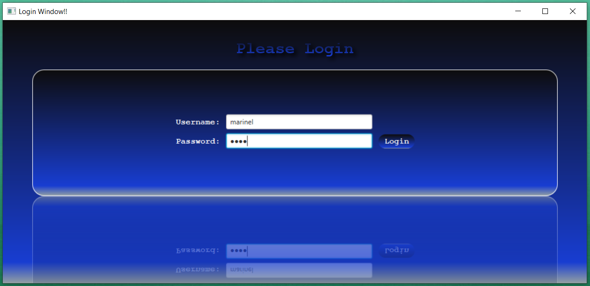 

Successful Login 
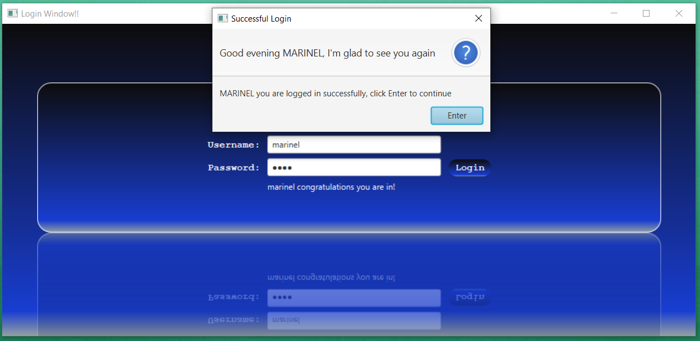 

Management and accounting 
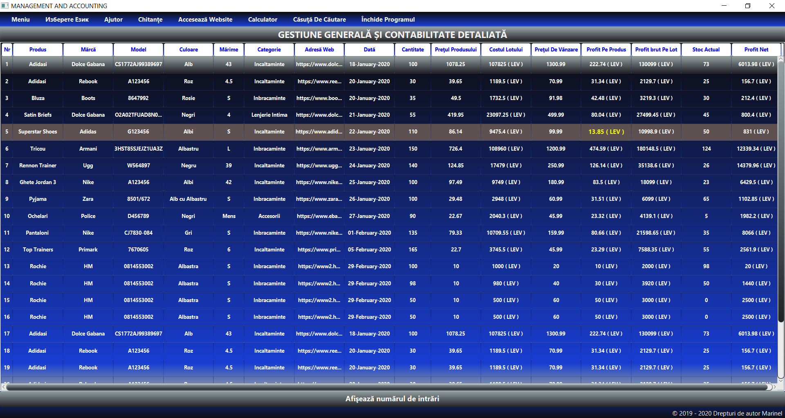 

Monthly profit 
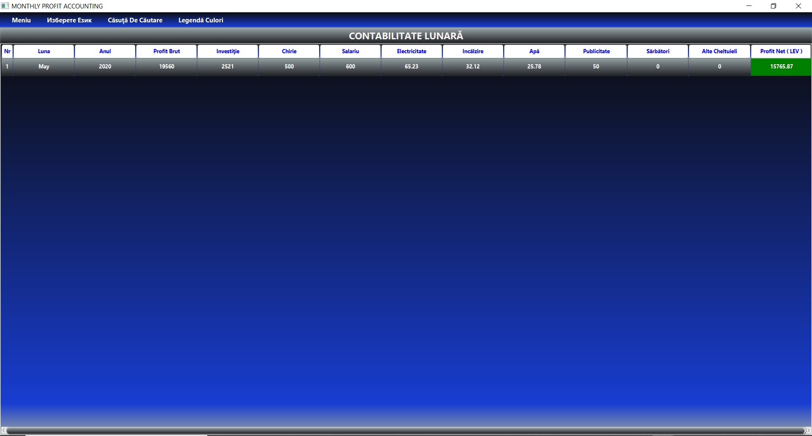 

Year profit 
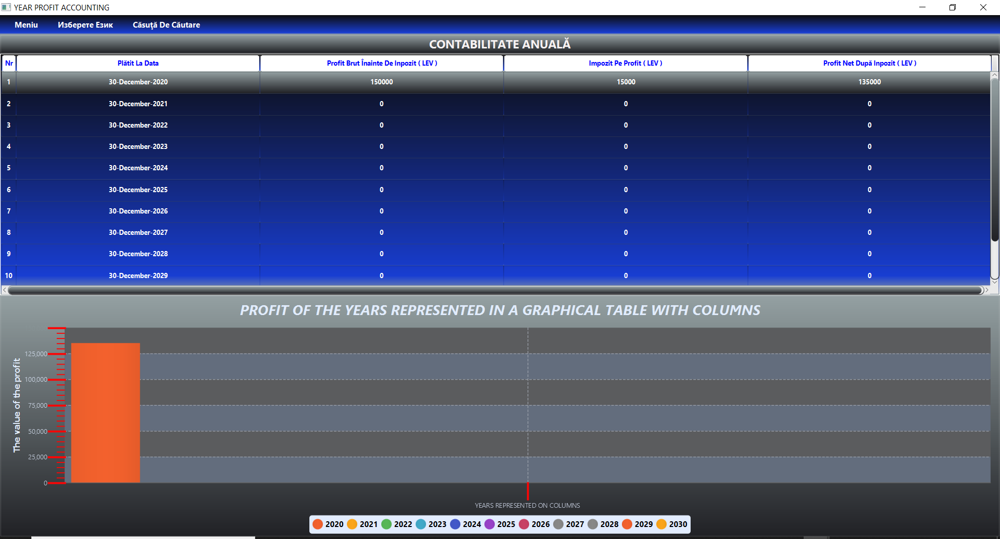 

Multiples screens 
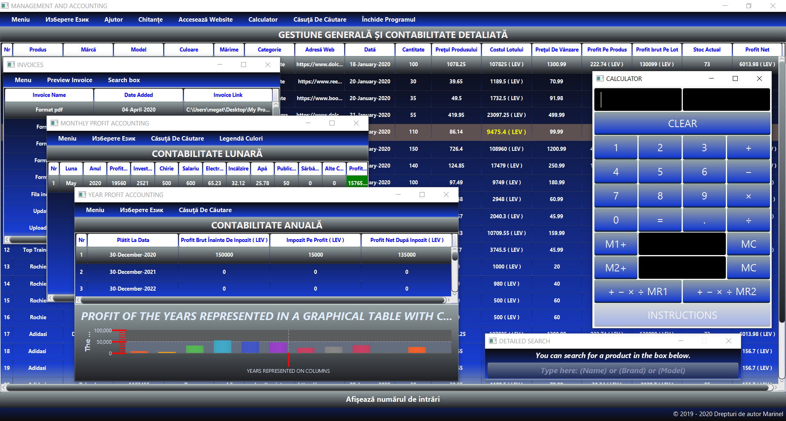 

Ivoice 
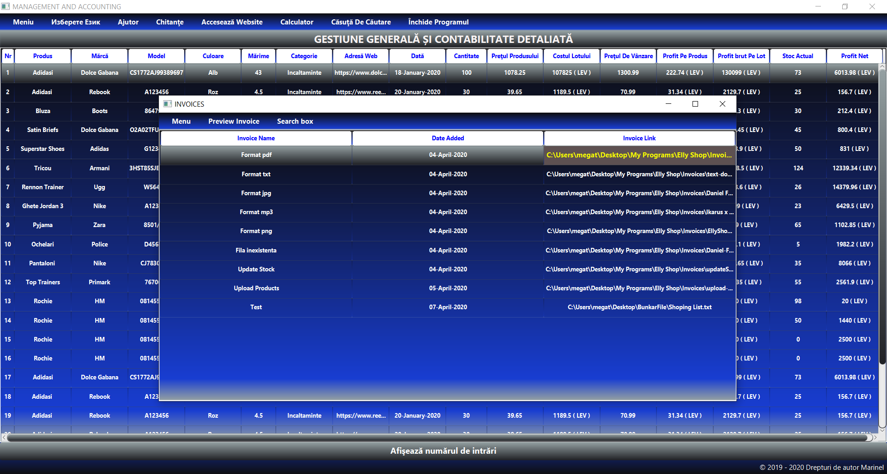 

Add product 
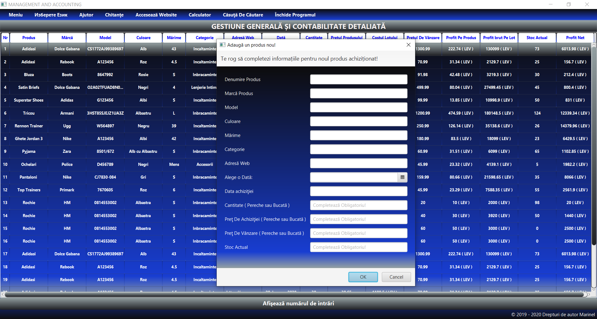 

Visit the website from where the product was purchased 
 

Currency exchange 
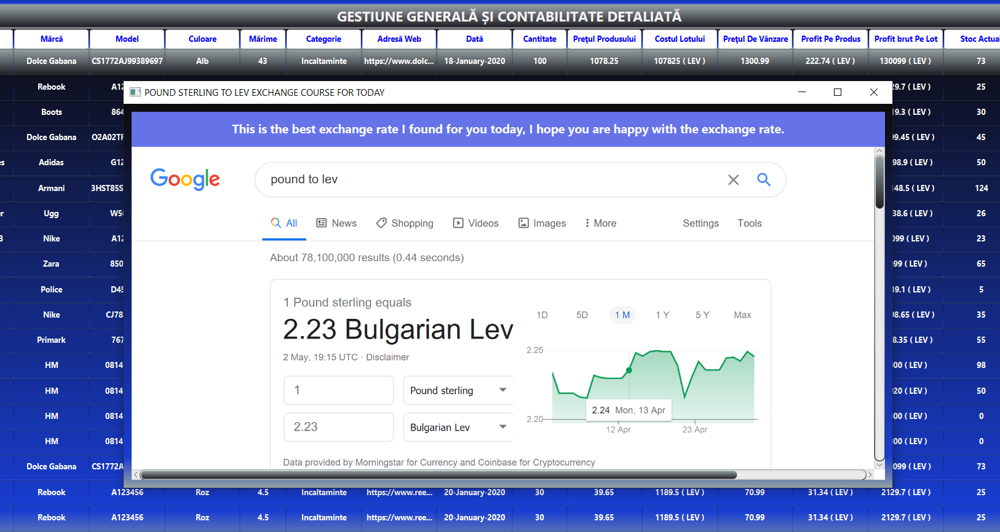 

Legend for monthly profit interface 
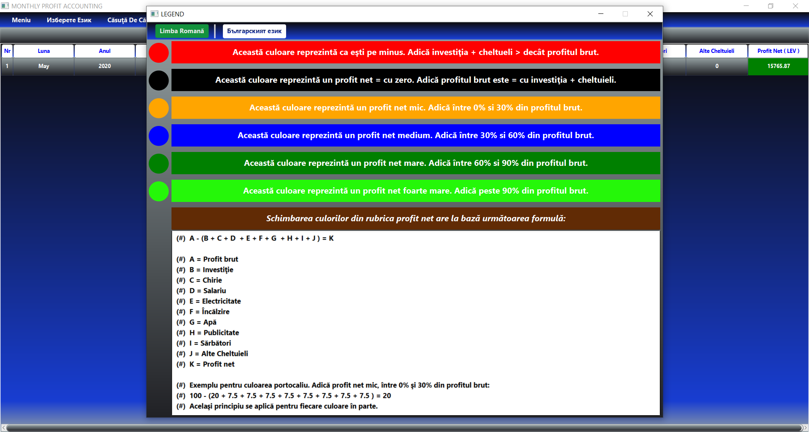 

Instructions 
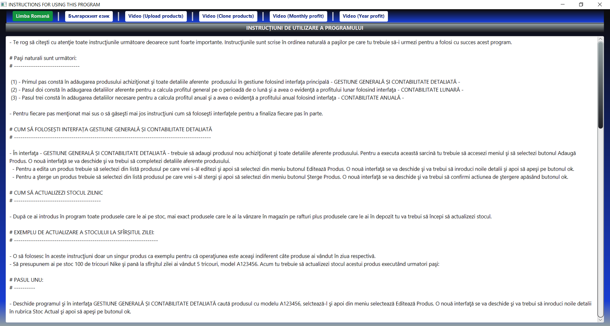 

Add invoice 
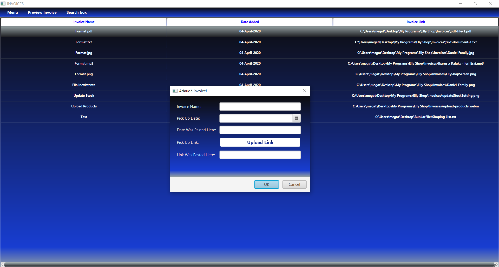 

Close the program 
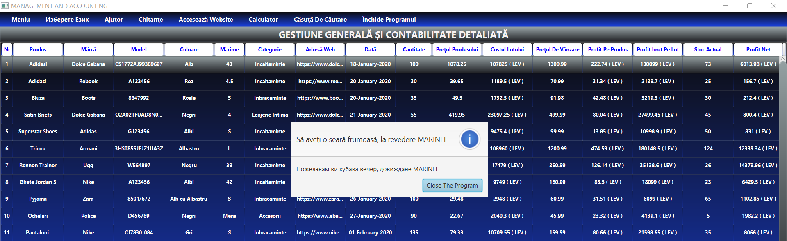 

Calculator 
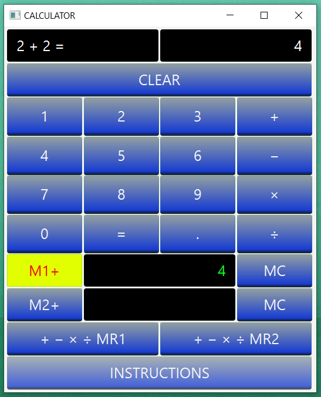 
